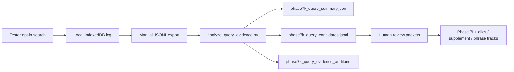

# Phase 7K Production Query Evidence Loop — Planning Document

**Status:** planning only — no implementation until reviewed  
**Baseline:** Phase 7J complete; featured bundle `bundle_full_20260616_phase7j_alias_round2_candidate`; catalog `norm-v3-featured-enriched-source-aliases-3-source-index-supplements-2`  
**Context gap:** Phase 7J audit explicitly waived real query logs (`Query logs | tester exports | Not available in repo`). Phase 7K closes that loop.

---

## 1. Purpose

Phase 7K designs a **privacy-conscious, local-first query evidence workflow** so future search improvements are driven by observed behavior, not guesswork.

It should answer:

| Question | Evidence source |
|---|---|
| What are users searching? | Aggregated `query_raw` + direction + bundle/catalog context |
| Which queries miss? | `result_status = miss` events, repeated-miss ranking |
| Which queries hit but likely confuse? | Multi-result hits, deep ladder fallbacks, tester feedback cross-links |
| Which repeated misses deserve review? | Offline dedupe + frequency + replay against current index |
| Which misses should remain no-hit? | Human classification into `should_remain_no_hit`, `typo_noise`, etc. |
| Which future artifact should each candidate go to? | Route via Phase 7J `gap_class` → destination artifact map |

**Relationship to prior work**

- **Phase 5B** shipped the core runtime: opt-in logging, IndexedDB store, export/clear, debug inspection UI, and `scripts/analyze_query_logs.py`.
- **Phases 7G–7J** built review taxonomies, gap miners, and publication paths — but without production query exports.
- **Phase 7K** connects those tracks: **production exports → offline analysis → curated candidate rows → existing human review packets** (7I phrase, alias/supplement tables, policy memos).

**Phase 7K is measurement and evidence routing only.** It does not change search behavior, publish bundles, or add aliases/supplements.

---

## 2. Evidence event schema

### 2.1 Design principle

Extend the existing `query_log_event_v1` rather than invent a parallel system. Introduce **`query_log_event_v2`** as the forward schema; keep v1 readable in export/analysis for backward compatibility.

Logging should capture **what the search path actually used**, not a recomputed shadow copy (today `query_log_runtime.ts` recomputes normalization — known TODO from Phase 5B).

### 2.2 Proposed `query_log_event_v2` fields

| Field | Type | Required | Source / notes |
|---|---|---|---|
| `schema_version` | `"query_log_event_v2"` | yes | Version gate |
| `event_id` | string | yes | Stable UUID at write time (export-safe; not tied to IDB autoincrement) |
| `log_id` | number | no | IndexedDB primary key; internal only |
| `timestamp_iso` | ISO 8601 UTC | yes | Existing |
| `app_version` | string | yes | From `package.json` |
| `bundle_id` | string | yes | Active bundle at settled search |
| `bundle_version` | string | no | Manifest version |
| `catalog_version` | string | no | Resolved from cached catalog entry at log time (not currently stored on `ActiveBundleMeta`; add at install or lookup from `CachedBundleCatalog`) |
| `storage_scope_id` | string | yes | Existing scope key |
| `norm_version` | string | yes | `normalization_ruleset` |
| `query_raw` | string | yes | Trimmed user input at settled search |
| `query_normalized_primary` | string \| null | yes | The **actual** normalized key that matched, or best candidate key tried on miss |
| `query_normalized_keys` | object | yes | Full ladder output (retain v1 shape for replay/debug) |
| `direction` | `source_to_target` \| `target_to_source` | yes | Existing |
| `ui_language` | `fr` \| `en` | yes | From `siralex.ui_locale` / active i18n locale |
| `result_status` | enum | yes | See §2.3 |
| `result_count` | int ≥ 0 | yes | Same as current `ir_ids_count` |
| `top_ir_ids` | string[] | yes | First N resolved IDs only (recommend **N = 5**); empty on miss |
| `matched_key_type` | ladder level \| `none` | yes | Same as `ladder_level_hit` |
| `matched_key` | string \| null | yes | From `searchQuery()` result |
| `latency_ms` | int ≥ 0 | yes | Wall time for settled search execution |
| `offline_or_online` | boolean | yes | `navigator.onLine` at log time (informational; app remains offline-first) |
| `session_bucket_id` | string | yes | Random UUID persisted in localStorage at first log enable; **not** a user ID |
| `logging_enabled` | `true` | yes | Assert opt-in at write |
| `consent_version` | string | yes | e.g. `"phase7k_tester_consent_v1"` — ties event to consent copy shown |

Optional future fields (defer unless needed):

- `search_index_directional`: boolean (bundle contract snapshot)
- `tester_label`: only if maintainer manually tags export manifest — **never** auto-collected

### 2.3 `result_status` enum

Derived at log time from search outcome (no user tagging in runtime):

| Value | Condition |
|---|---|
| `miss` | `result_count === 0` |
| `hit_single` | `result_count === 1` |
| `hit_multi` | `result_count > 1` (candidate for ranking/interpretability review) |
| `hit_deep_ladder` | hit where `matched_key_type` ∈ `{punct_stripped, nospace}` (normalization fallback signal) |

A query can be both `hit_multi` and `hit_deep_ladder`; analysis treats them as overlapping signals, not mutually exclusive tags stored as arrays in the offline candidate row.

### 2.4 Fields explicitly **not** collected

Never store, export, or transmit:

- name, email, phone, account identifiers
- IP address (no server = none by default; do not add beacon endpoints)
- precise geolocation
- device fingerprint / advertising IDs
- full session history beyond capped local log store
- freeform user notes (those stay in separate tester feedback forms)
- clipboard contents, surrounding page URL parameters with PII
- full record payloads / gloss text (only `ir_id` references)

Search terms themselves are **dictionary lookup strings**, not identity — but they can still be sensitive; treat exports as confidential tester data (per `PHASE_6C_TESTER_PACKET.md`).

### 2.5 Write semantics (unchanged intent, tightened spec)

- **Opt-in only:** logging off by default (`siralex.query_logging.enabled !== "true"`).
- **Settled query only:** retain 800 ms settle + seq/direction/bundle guards (prevents keystroke spam).
- **Append-only** while enabled; no mutation of prior rows.
- **Fail closed:** logging errors must not break search.

---

## 3. Privacy posture

### Decisions

| Question | Phase 7K answer |
|---|---|
| Local-only by default? | **Yes.** IndexedDB only; no network calls for logging. |
| Manual export? | **Yes.** Download JSONL via existing Export button; no auto-upload. |
| Tester opt-in? | **Yes.** Explicit toggle + first-enable consent acknowledgment. |
| Anonymize before export? | **Optional second export mode** (Phase 7K implementation): hash `query_raw` with per-export salt, drop `session_bucket_id`, keep normalized keys + counts for aggregate analysis. Default export remains full-fidelity for maintainer replay. |
| Raw vs normalized? | **Keep both** in default export (required for index replay and alias review). Anonymized export may drop raw and keep normalized + direction + status. |
| Retention? | **Cap locally:** max **2,000 events** OR **90 days**, whichever stricter; FIFO prune on append. |
| Clear? | **Instant full clear** (existing) + per-bundle-scope clear (existing helper). |

### Posture summary

```text
local-first logging
manual export
no third-party analytics
no automatic upload
clear tester consent before first log write
exports treated as confidential — do not commit to git by default
```

Aligns with workspace rules: offline-first, no third-party data in git, provenance preserved in downstream review artifacts (not in raw logs).

---

## 4. Local storage / export design

### 4.1 Storage location

| Layer | Role |
|---|---|
| **IndexedDB** `query_logs` store | Primary append-only event log (already exists) |
| **localStorage** | Toggle flag, `session_bucket_id`, consent ack timestamp/version |
| **Downloadable JSONL** | Manual export artifact for offline analysis |
| **Not localStorage for events** | Avoid size limits and synchronous bloat |

### 4.2 Retention and caps

On each append:

1. If row count > **2,000**, delete oldest rows (by `log_id` / timestamp) until ≤ cap.
2. Also drop rows older than **90 days**.
3. Surface in diagnostics: `{count} logs · oldest {date} · cap 2000 / 90d`.

### 4.3 Export formats

**Default export** (maintainer / willing tester):

```text
siralex-query-logs-{UTC timestamp}.jsonl
```

One JSON object per line; include `schema_version` per row.

**Optional anonymized export** (for wider sharing):

- Replace `query_raw` with `query_raw_sha256` (salted)
- Omit `session_bucket_id`, `event_id` prefix patterns if desired
- Keep `query_normalized_primary`, `direction`, `result_status`, bundle/catalog metadata

Export manifest sidecar (maintainer-created, not auto-generated in app):

```json
{
  "export_received_at": "2026-06-18",
  "tester_label": "tester_A",
  "app_version": "...",
  "bundle_id": "...",
  "consent": "explicit_opt_in"
}
```

Store outside repo.

### 4.4 Controls (existing + planned)

| Control | Status | Phase 7K |
|---|---|---|
| Enable/disable toggle | exists | Add first-enable consent gate |
| Export JSONL | exists | Support v1+v2 rows; optional anonymized export |
| Clear all logs | exists | unchanged |
| Recent N view | exists (N=50) | Add columns: status, count, matched_key |
| Copy diagnostic info | missing | Add: app_version, bundle_id, catalog_version, norm_version, log count |

---

## 5. Offline analysis pipeline

### 5.1 Pipeline overview



### 5.2 Inputs

| Input | Purpose |
|---|---|
| One or more exported `.jsonl` files | Primary behavioral evidence |
| Featured bundle dir or `search_index.jsonl` | Replay lookup behavior |
| `shared/aliases/source_aliases_v1.jsonl` | Mark `already_addressed` |
| `shared/source_index_supplements/...` | Mark `already_addressed` |
| `shared/phrase_review/phrase_miss_review_v1.jsonl` | Link phrase misses |
| Optional tester feedback template | Cross-check confusion reports |

### 5.3 Processing stages

1. **Ingest + validate** — schema version, required fields, parse error report.
2. **Normalize keys** — dedupe by `(query_raw.casefold(), direction, bundle_id)`; track `occurrence_count`, first/last seen.
3. **Aggregate metrics** — hit/miss rates, repeated misses, multi-hit rate, ladder distribution, direction split (extend current `analyze_query_logs.py`).
4. **Replay** — for each unique miss (and optional multi-hit), run norm_v3 directional ladder against featured `search_index.jsonl` (same contract as Phase 7J).
5. **Seed classification** — **heuristic pre-labels only**; every row starts `review_status: candidate` and requires human review. No auto-approval.
6. **Cross-link** — attach evidence from aliases, supplements, phrase review, prior `phase7j_gap_*` IDs when query matches.
7. **Emit artifacts**:

```text
docs/reports/phase7k_query_evidence_audit.md
shared/query_evidence/phase7k_query_candidates.jsonl
shared/query_evidence/phase7k_query_summary.json
```

### 5.4 Candidate row schema (`phase7k_query_evidence_v1`)

Align shape with `phase7j_gap_review_v1` for downstream reuse:

| Field | Notes |
|---|---|
| `review_id` | `phase7k_evidence_{seq}` |
| `schema_version` | `phase7k_query_evidence_v1` |
| `query` | From export |
| `search_direction` | |
| `occurrence_count` | From exports |
| `first_seen` / `last_seen` | ISO timestamps |
| `current_result` | Replay outcome: `miss`, `hit (N)`, etc. |
| `gap_class` | Phase 7J taxonomy (below) |
| `priority_score` | Heuristic rank for human queue ordering |
| `priority_reasons` | Explainable strings |
| `resolved_ir_ids` | From replay |
| `evidence_sources` | `query_log_export`, `search_index_replay`, `phrase_miss_review_v1`, … |
| `recommended_destination_artifact` | Target file or `policy_memo` or `null` |
| `review_status` | `candidate` default |
| `reason_not_to_apply_automatically` | Required |
| `source_bundle_id` / `source_catalog_version` | From log metadata |
| `related_log_event_ids` | Traceability |

### 5.5 `gap_class` taxonomy (Phase 7J-aligned)

| `gap_class` | Typical signal | Destination artifact |
|---|---|---|
| `reviewed_source_alias_candidate` | Miss; singular canonical exists; plural/inflection pattern | `shared/aliases/source_aliases_v1.jsonl` |
| `reviewed_source_index_supplement_candidate` | Hit but incomplete mapping; miner-like gloss gap | `shared/source_index_supplements/source_index_supplements_v1.jsonl` |
| `phrase_miss_candidate` | Multi-token; related phrase/term hits only | `shared/phrase_review/source_phrase_aliases_v1.jsonl` (blocked until 7I approval) |
| `true_dictionary_entry_gap` | Miss; no safe routing target | `null` / dictionary editorial track |
| `ranking_ambiguity_issue` | `hit_multi`; Phase 7G interpretability | `policy_memo` / UI track |
| `target_side_issue` | `target_to_source` policy misses (e.g. plain Kun class) | `policy_memo` |
| `typo_noise` | Obvious typo; no fuzzy correction | `null` |
| `should_remain_no_hit` | Idiom/composition unsafely routed | `null` |
| `ui_copy_issue` | Hit/miss OK but tester feedback + no index fix (empty state copy, direction confusion) | docs / i18n — **not** index artifacts |
| `already_addressed` | Query now hits via shipped 7A–7J fix | `null` (regression monitor) |

Heuristic classifiers must **never** write approved alias/supplement rows — only queue candidates for human packets (same boundary as Phase 7J).

### 5.6 Priority queues (analysis output)

Mirror Phase 7J audit sections:

- **P1** — repeated miss (≥3) + high-salience vocabulary
- **P2** — repeated miss (≥2) or single miss with strong replay evidence
- **P3** — multi-hit confusion, deep ladder hits
- **Monitor** — `already_addressed` regression controls

### 5.7 Tooling strategy

- **Extend** `scripts/analyze_query_logs.py` → or add `scripts/analyze_query_evidence.py` that wraps summary + candidate emission.
- **Reuse** `api/source_index_gap_discovery/` replay/normalization where possible.
- **Stdlib-only** Python for tester-machine analysis (consistent with current script).
- **Validator** `api/query_evidence/tests/` for candidate JSONL invariants (no `approved` rows, valid `gap_class` enum).

---

## 6. Tester / debug UI concept

### Surface placement

Keep inside **Advanced diagnostics** (`<details>`) — not consumer-facing. Same gating as today.

### Tester-only actions

| Action | Behavior |
|---|---|
| View recent searches | Table: query, hit/miss, count, ladder, timestamp (extend current) |
| Export query log | Default JSONL download |
| Export anonymized | Optional second button (Phase 7K) |
| Clear query log | Confirm dialog (existing) |
| Copy diagnostic info | Clipboard: app_version, bundle_id, catalog_version, norm_version, ui_language, log count, session_bucket_id prefix (e.g. first 8 chars) |

### First-enable consent flow

When toggling **On** for the first time (or after consent version bump):

1. Show short modal / inline confirm with §7 copy.
2. Require explicit **Agree** before `setQueryLoggingEnabled(true)`.
3. Record `siralex.query_logging.consent_version` + timestamp in localStorage.

Turning **Off** stops new writes; does not auto-clear existing logs.

### Production vs dev

- Production deploy: diagnostics remain collapsible; no query logging prompt on first visit.
- Tester packets (`PHASE_6C_TESTER_PACKET.md` successor): instruct opt-in **before** session, export **after**.

---

## 7. Consent and safety copy

Draft tester language (FR primary for Guinea-facing deploy; EN mirror in i18n):

**Français (first-enable):**

> Cette version de test peut enregistrer **localement** vos recherches sur cet appareil pour améliorer le dictionnaire.
> Les journaux **ne sont pas envoyés automatiquement**.
> Vous pouvez les **exporter** ou les **effacer** à tout moment dans Diagnostics avancés.
> N'activez cette option que si vous acceptez que vos termes de recherche soient conservés sur l'appareil.

**English:**

> This test build can save your search terms **locally on this device** so we can improve dictionary search.
> Logs are **not uploaded automatically**.
> You can **export** or **clear** them at any time under Advanced diagnostics.
> Only turn this on if you are comfortable with your search terms being stored on this device.

**Export request (maintainer → tester):**

> Please send the exported `.jsonl` file only if you are comfortable sharing the exact searches you typed. Do not edit the file manually.

Not a legal policy — operational tester consent only.

---

## 8. Validation strategy

### Unit tests (Vitest — extend existing suites)

| Area | Cases |
|---|---|
| Event creation v2 | All required fields; `result_status` derivation; `top_ir_ids` capped at 5 |
| Redaction / anonymized export | Raw dropped/hashed; salts differ per export |
| Retention cap | Append 2001st row evicts oldest; 91-day row evicted |
| Export JSONL | v1+v2 mixed store; valid NDJSON; filename format |
| Consent gate | No write when consent not acked; ack recorded |
| Settled logging | Still ignores superseded seq / empty query |
| Schema validation | Reject missing `bundle_id`, negative counts |

Existing coverage: `query_log_store.test.ts`, `query_log_runtime.test.ts`, `query_log_controls.test.ts`.

### Offline analysis tests (Python)

- Fixture: `shared/query_evidence/fixtures/sample_export_v2.jsonl` (synthetic, no real user data)
- Golden: expected `phase7k_query_summary.json` + candidate count
- Invariant: no candidate row with `review_status: approved`
- Replay: known miss `fruits` against pre-7J bundle → `reviewed_source_alias_candidate`; against post-7J bundle → `already_addressed`

### Manual smoke (no production upload)

1. Enable logging with consent in dev build.
2. Run scripted queries: hit single, hit multi (`mère`), miss, target-side (`Kun`).
3. Export JSONL; run analysis CLI.
4. Verify audit markdown sections and candidate queue.
5. Clear logs; confirm count zero.

### Explicit test non-goals

- No staging/production telemetry endpoints
- No real tester exports committed to git
- No automated gap_class approval

---

## 9. Risks

| Risk | Impact | Mitigation |
|---|---|---|
| Search terms are sensitive | Tester embarrassment, indirect PII in queries | Opt-in, local-only, manual export, optional anonymized export, do-not-commit policy |
| Normalization drift (log vs search) | Wrong replay/classification | Phase 7K: log fields from `searchQuery()` return value, not recomputation |
| Missing `catalog_version` in bundle meta | Weak provenance in multi-catalog tests | Resolve at install/log from cached catalog |
| Unbounded log growth | Storage / performance | 2000-row + 90-day cap |
| False "confusion" from multi-hit | Over-queue ranking issues | Require occurrence threshold or tester feedback cross-link for P1 |
| Heuristic misclassification | Bad alias candidates | Human review only; `reason_not_to_apply_automatically` required; no auto-apply |
| v1 export backlog | Analysis complexity | Dual-schema ingest; migrate on read optional |
| Small sample size | Overfitting to one tester | Aggregate across exports; report confidence in audit |
| `ui_copy_issue` vs index gap | Wrong artifact routing | Separate class with `recommended_destination_artifact: null` + docs track |

---

## 10. Non-goals

Phase 7K explicitly excludes:

- Google Analytics, Mixpanel, PostHog, or any third-party analytics SDK
- Automatic remote telemetry or background sync
- User identity tracking, accounts, or cross-device profiles
- IP / geolocation collection
- New search behavior, ranking, normalization, or fuzzy matching
- New aliases, supplements, or phrase aliases
- Bundle publication or catalog updates
- Auto-approval of candidates
- Committing raw tester exports to the repository
- Consumer-facing "analytics" UI

---

## 11. Recommendation

**Proceed with a bounded Phase 7K implementation PR** after plan review, structured as three deliverables:

### Track A — Runtime evidence hardening (web)

1. **`query_log_event_v2`** with fields in §2; populate from `searchQuery()` outputs + timing.
2. **Retention cap** + consent gate + optional anonymized export.
3. **Copy diagnostic info** button.
4. Extend diagnostics table columns minimally.

*Estimated scope:* small/medium; builds directly on Phase 5B code.

### Track B — Offline analysis (Python + shared artifacts)

1. **`scripts/analyze_query_evidence.py`** (or extend existing analyzer) emitting the three Phase 7K artifacts.
2. **`shared/query_evidence/`** directory + JSONL validator tests.
3. Heuristic pre-classification into Phase 7J `gap_class` with human-review-only status.

*Estimated scope:* medium; reuses gap-discovery replay patterns from Phase 7J.

### Track C — Tester operations (docs only at implementation time)

1. Update tester packet with Phase 7K consent/export steps (separate doc; not in this planning pass per your ROADMAP boundary).
2. Run first **production evidence collection round** against post-7J bundle after deploy verification.

### Sequencing

```text
Review this plan
  → Track A (runtime v2 + cap + consent)
  → Track B (analysis CLI + fixtures)
  → Pilot with 1–2 testers on featured 7J bundle
  → Human review of phase7k_query_candidates.jsonl
  → Feed approved rows into Phase 7L review packets (out of 7K scope)
```

### Why not greenfield?

Roughly **70% of the Phase 5B logging loop already exists** (IndexedDB store, opt-in toggle, export/clear, diagnostics UI, tests, basic analyzer). Phase 7K should **extend and connect** that foundation to the Phase 7J evidence taxonomy rather than replace it.

### Success criteria (Phase 7K complete)

- [ ] Testers can opt in with clear consent and export JSONL without network calls
- [ ] Logs are capped and clearable
- [ ] Offline analysis produces audit + candidate JSONL aligned with Phase 7J classes
- [ ] At least one synthetic fixture round-trip validated in CI
- [ ] No search, index, catalog, ranking, normalization, or UI behavior change beyond the diagnostics/query-evidence surfaces explicitly approved for Phase 7K.
- [ ] First real export analyzed into a prioritized human review queue (operational, post-merge)

---

**Planning only. No code, catalog, bundle, or ROADMAP changes in this pass.**
